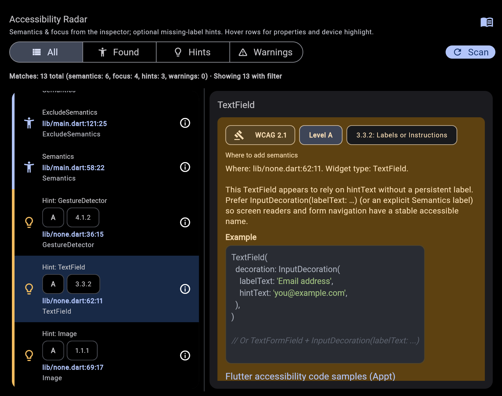

# Accessibility Radar

Flutter DevTools extension that scans the live widget tree for semantics, and accessibility related widgets (`Semantics`, focus, shortcuts, and similar), optional **WCAG-oriented** hints, and structural **warnings**.

The scan reflects what is on screen in the running app, not the file open in your editor. Hints are **heuristics** confirm with your own review or audit.

Resources: [APPT Accessibility Handbook (PDF)](https://appt.org/en/pdf/appt-accessibility-handbook.pdf) · [appt.org](https://appt.org/)



## Use in your app

Add as a **dev dependency** (match the version on [pub.dev](https://pub.dev/packages/accessibility_radar)):

```yaml
dev_dependencies:
  accessibility_radar: ^0.1.0
```

```bash
flutter pub get
```

Run the app in **debug** or **profile**, open DevTools, enable the extension if prompted, then open the **accessibility_radar** tab.

## Developing this package

### Build the extension (`extension/devtools`)

From the root, after UI or dependency changes:

```bash
flutter pub get
dart run devtools_extensions build_and_copy --source=. --dest=./extension/devtools
```

Before publishing: `dart run devtools_extensions validate --package=.`

### Example app

```bash
cd example
flutter run
```

Rebuild the extension when you change the DevTools UI, then in DevTools open **accessibility_radar** and press the Scan button.

### Test UI in Chrome

Quick browser loop (VM-backed behavior still needs a real app and DevTools):

```bash
flutter run -d chrome --dart-define=use_simulated_environment=true
```
